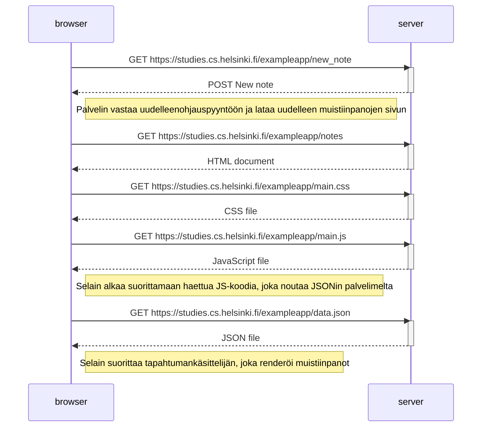

```mermaid
sequenceDiagram
    participant browser
    participant server
    
    browser->>server: GET https://studies.cs.helsinki.fi/exampleapp/new_note
    activate server
    server-->>browser: POST New note
    deactivate server

    Note right of browser: Palvelin vastaa uudelleenohjauspyyntöön ja lataa uudelleen muistiinpanojen sivun

    browser->>server: GET https://studies.cs.helsinki.fi/exampleapp/notes
    activate server
    server-->>browser: HTML document
    deactivate server
    
    browser->>server: GET https://studies.cs.helsinki.fi/exampleapp/main.css
    activate server
    server-->>browser: CSS file
    deactivate server
    
    browser->>server: GET https://studies.cs.helsinki.fi/exampleapp/main.js
    activate server
    server-->>browser: JavaScript file
    deactivate server
    
    Note right of browser: Selain alkaa suorittamaan haettua JS-koodia, joka noutaa JSONin palvelimelta
    
    browser->>server: GET https://studies.cs.helsinki.fi/exampleapp/data.json
    activate server
    server-->>browser: JSON file
    deactivate server    

    Note right of browser: Selain suorittaa tapahtumankäsittelijän, joka renderöi muistiinpanot
```